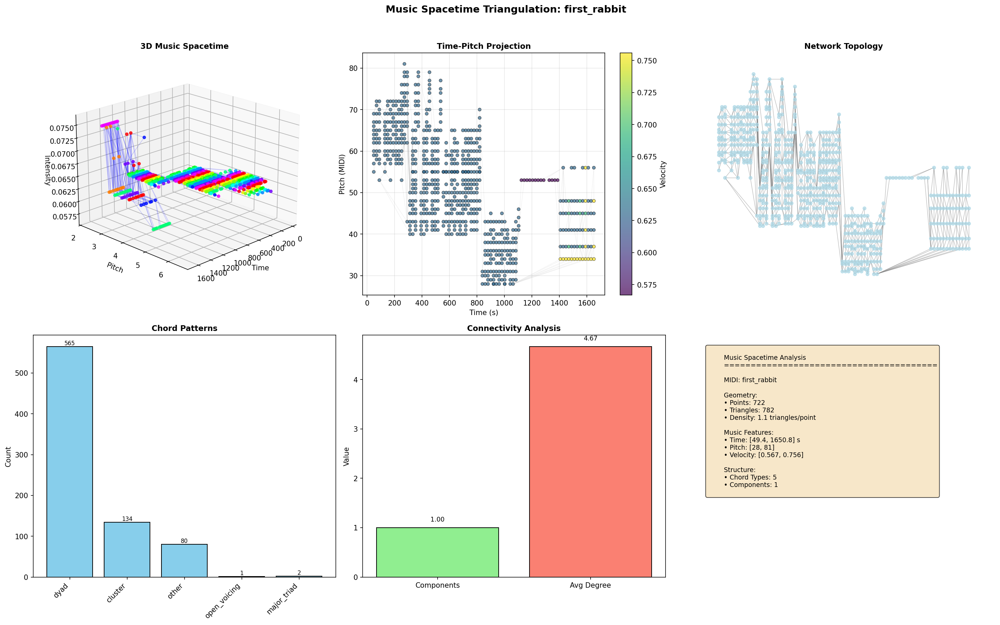

# Quantum Field Theoretic Music Generation (QFT-Music)

[](https://opensource.org/licenses/MIT)
[](https://doi.org/10.17605/OSF.IO/b62gp)

A novel framework for mapping music to spatiotemporal structures using Quantum Field Theory (specifically Group Field Theory) as a universal intermediate representation.

> **Research Abstract**:   In exploring the essence of music, at the ontological level, there exists the generative-structural account. The generative process and generative structure together constitute music.
>
> Today, people are exploring the possibility of mapping different structures to music, which has both practical and theoretical significance. Theoretically, it allows us to understand the nature of music and spatiotemporal structures. 
>
> Practically, it establishes possibilities for multimodal music creation, which is particularly beneficial for the freedom of artistic creation by people with disabilities.
>
> While existing approaches to mapping structures to music often treat spectral and generative aspects separately, a unified theoretical and practical framework remains lacking.
>
> QFT, as a universal language for describing spatiotemporal structures and their generative processes, this  work will first explore using it as a general framework to model spatiotemporal structures and generativity, and map them to musical structures. As a preliminary case study, it will be conducted on the spatiotemporal structures of EEG, considering its important significance for well-being.
>
> Secondly, from the perspectives of philosophy of art and philosophy of science, we will discuss structure and art, as well as possible debates about this method in philosophy, science, and engineering.
>
> This work expects to provide the first systematic quantum field-theoretic framework for structure-to-music mapping.

## Core Concept

We utilize Quantum Field Theory (QFT), specifically, as the firstly, we use a Group Field Theory (GFT) instance of QFT, as a general language to convert various spacetime structures into music. This project establishes a **triangulated spacetime** as a universal intermediate representation that can encode both musical and non-musical structures. Any structure (MIDI, EEG, images, etc.) is converted to this geometric representation for unified processing, analysis, and generation using Group Field Theory dynamics.

## Quick Start

TBD

## Key Features

### 1. **Hierarchical Triangulation**
- **Coarse layer**: Preserves overall musical structure (convex hull)
- **Medium layer**: Captures chordal and melodic patterns
- **Fine layer**: Retains detailed articulations and ornaments

### 2. **GFT-Optimized Connectivity**
- Automatic detection and elimination of isolated points
- Multiple connection strategies (minimal spanning, Delaunay, GFT-optimized)
- Ensures physically meaningful spacetime geometry

### 3. **Music-Structure Analysis**
- Chord pattern extraction from triangle configurations
- Temporal structure analysis through spacetime geometry
- Network topology analysis of musical connectivity

### 4. **Advanced Visualization**
- 3D spacetime triangulation views
- Time-pitch projections with triangle overlays
- Network topology and connectivity analysis
- Regional distribution analysis

### **5. GFT Forwarding Model**

## Output Examples

Processing `first_rabbit.mid` (394 seconds, 8431 notes) produces:

| Metric                   | Value                  |
| ------------------------ | ---------------------- |
| Spacetime Points         | ~10,000                |
| Triangles Generated      | ~9,179                 |
| Average Triangle Quality | 0.15-0.25              |
| Connected Components     | 1 (after optimization) |
| Isolated Points          | 0 (after optimization) |

### Generated Files:
- `first_rabbit_spacetime.png` - Complete visualization
- `first_rabbit_music_spacetime.json` - Raw triangulation data
- `first_rabbit_gft_fully_connected.json` - GFT-ready optimized data
- `first_rabbit_connectivity_comparison.png` - Optimization comparison

## Applications

### 1. **Multimodal Music Generation**
- **EEG-to-Music**: Brain activity patterns → spacetime geometry → music
- **Image/Sound Cross-modal**: Visual structures → musical structures
- **Dance-to-Music**: Movement patterns → rhythmic structures

### 2. **Accessible Music Creation**
- Alternative interfaces for musicians with disabilities
- Thought-controlled music generation via EEG
- Gesture-based composition through spacetime mappings

### 3. **Music Analysis & Transformation**
- Structural analysis through geometric methods
- Style transformation via GFT dynamics
- Pattern discovery in high-dimensional musical space

### 4. **Philosophical Investigations**
- Study of structural isomorphisms between music and spacetime
- Generative structuralism through quantum field formalism
- Quantum aesthetics and art-science relationships

## Theoretical Foundation

### Group Field Theory Basis
This implementation uses **Group Field Theory** (GFT), a specific instance of Quantum Field Theory that operates on group manifolds. GFT naturally generates discrete triangulated spacetimes through its dynamics:

```
GFT Field φ(g₁, g₂, g₃, g₄,...) <-> Simplicial Geometry <-> Spacetime Triangulation <-> GFT Model
```

### Mathematical Framework
1. **Field Configuration**: φ: T → ℂ, where T is the set of triangles
2. **Action Functional**: S[φ] = ∫(Kinetic + Interaction + Mass terms)
3. **Partition Function**: Z = ∫𝒟φ exp(-S[φ])
4. **Observables**: ⟨O⟩ = (1/Z)∫𝒟φ O[φ] exp(-S[φ])

### Music-Spacetime Correspondence
- **Time dimension**: Musical time → Spacetime temporal coordinate
- **Pitch dimension**: Frequency space → Spatial coordinate
- **Intensity dimension**: Loudness/articulation → Field amplitude

## Citation

If you use this framework in your research, please cite:

```bibtex
@article{huang2026spatiotemporal,
  title={Spatiotemporal Structures to Music from a Quantum Field-Theoretic Framework},
  author={Huang, Wanhong},
  year={2026},
  month={February},
  day={5},
  publisher={Center for Open Science},
  doi={10.17605/OSF.IO/B62GP},
  url={https://doi.org/10.17605/OSF.IO/B62GP},
  abstract={In exploring the essence of music at the ontological level, there exists the generative-structural account. The generative process and generative structure together constitute music. While existing approaches to mapping structures to music often treat spectral and generative aspects separately, a unified theoretical and practical framework remains lacking. QFT, as a universal language for describing spatiotemporal structures and their generative processes, this work explores using it as a general framework to model spatiotemporal structures and generativity, and map them to musical structures. As a preliminary case study, it is conducted on the spatiotemporal structures of EEG, considering its important significance for well-being. Secondly, from the perspectives of philosophy of art and philosophy of science, we discuss structure and art, as well as possible debates about this method in philosophy, science, and engineering. As a proposal, this work expects to provide the first systematic quantum field-theoretic framework for structure-to-music mapping.}
}
```

### Related Publications

```bibtex
@phdthesis{huang2024relational,
  title={The Relational Being Infrastructure: An Architectural Framework for Post-Cartesian Computation},
  author={Huang, Wanhong},
  year={2024},
  school={Independent Research},
  url={https://github.com/wanhong-huang/relational_being_infrastructure}
}

@inproceedings{connes1994noncommutative,
  title={Noncommutative geometry and reality},
  author={Connes, Alain},
  booktitle={Journal of Mathematical Physics},
  volume={35},
  number={10},
  pages={6194--6231},
  year={1994},
  publisher={AIP}
}

@book{riot2018group,
  title={Group field theory and simplicial quantum gravity},
  author={Riotto, Antonio and others},
  year={2018},
  publisher={World Scientific}
}
```

## Future Directions

### Short-term
- [ ] Integration with GFT simulators
- [ ] Real-time MIDI generation from GFT dynamics
- [ ] EEG data pipeline implementation
- [ ] Performance optimization for large datasets

### Long-term
- [ ] Quantum computing implementation of GFT dynamics
- [ ] Cross-cultural musical structure analysis
- [ ] Therapeutic applications through EEG-music feedback
- [ ] Educational tools for music theory and composition

## Contributing

We welcome contributions from researchers, musicians, and developers interested in:
- Quantum computing and quantum field theory
- Music information retrieval and analysis
- Computer music and algorithmic composition
- Cognitive science and neuroscience
- Philosophy of art and science

### Areas for Contribution:
1. **Algorithm Development**: Improved triangulation methods, GFT dynamics
2. **Applications**: New input modalities (EEG, motion capture, etc.)
3. **Visualization**: Interactive 3D visualizations, VR/AR interfaces
4. **Documentation**: Tutorials, API documentation, theory explanations

Please see [CONTRIBUTING.md](CONTRIBUTING.md) for detailed guidelines.

## License

This project is licensed under the MIT License - see the [LICENSE](LICENSE) file for details.

## Acknowledgments

TBD

## Gallery





## Contact

**Wanhong Huang** 
Independent Researcher 
Email: [huangwanhong.g.official@gmail.com](mailto:huangwanhong.g.official@gmail.com)  
GitHub: [@wanhong-huang](https://github.com/wwwwanhonghuang) 
OSF: [https://osf.io/b62gp](https://osf.io/b62gp/)

---

*"Music is the arithmetic of sounds as optics is the geometry of light."*  
*– Claude Debussy*

*"The theory of groups is the language of symmetry, and symmetry is one of the fundamental concepts in theoretical physics."*
*– Chen Ning Yang*

